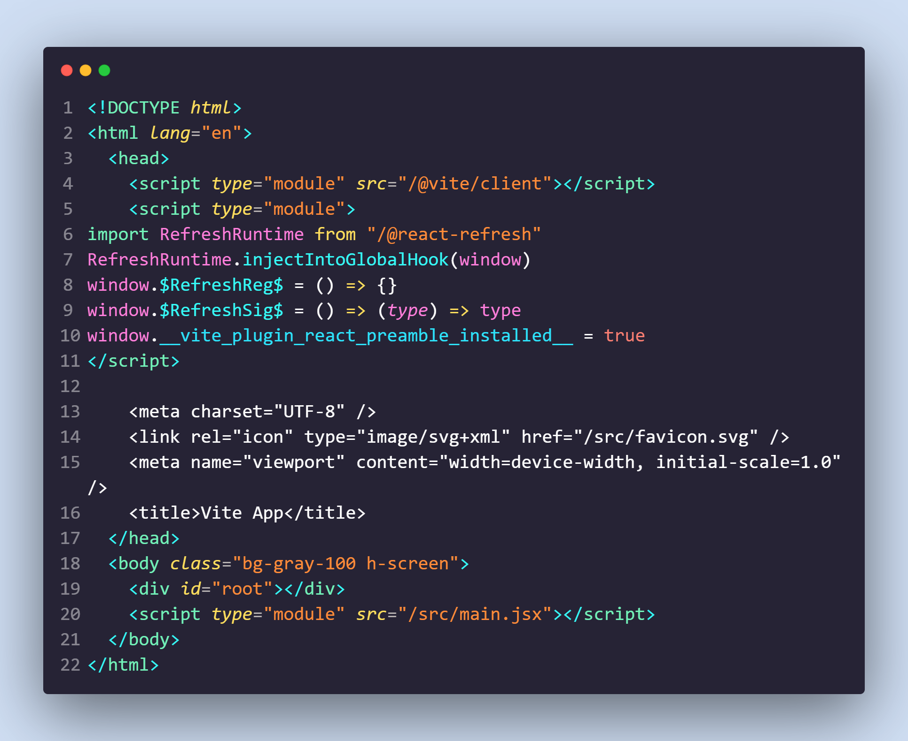
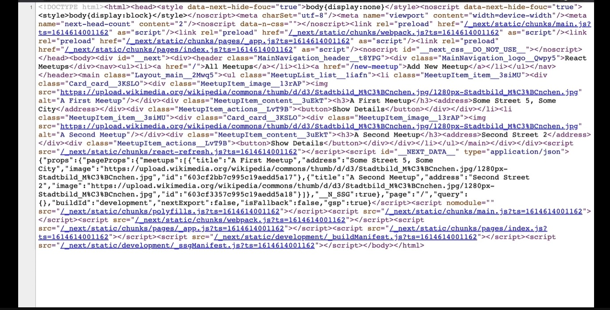

# Next.js Basics
## Definiciones:
### __Client Side Rendering(CSR):__
<div style="text-align: justify">

Este tipo de reenderizado se hace mediante páginas de javascript vanilla, aplicaciones de Create React App(CRA) o tabién mediante otros frameworks de javasctipt como Astro o Gatsby.

El usuario hace un request al servidor donde esta almacenada la página, la respuesta es un paquete con todo el javascript, HTML y jsx de la página, el navegador tiene que esperar a la respuesta y luego procesar todo el javascript, paquetes, lógica e interactividad de la página. Una vez procesado todo el javascript y el jsx el navegador reenderiza el resultado del HTML y el js y jsx.

Cuando estamos en un proyecto de React, la respuesta del servidor va a ser una plantilla de HTML con todo lo básico y una etiqueta de body con un id root. En este body se cargará todo el contenido generado por el jsx solamente depués de que el navegador lo procese tras haberlo recibido como parte de la respuesta del servidor. Es por esa razón que el código fuente se encuentra tan vacio, pues, todo el proceso de reenderizado lo esta realizando el navegador en tiempo real mediante el código jsx proporcionado por el servidor. Todo se va a estar procesando y reenderizando desde el navegador o, *"cliente"*.

<br/>


<br/>

* #### Pros:
* #### Contras:
</div>

### __Server Side Rendering(SSR):__
<div style="text-align: justify">

Este tipo de reenderizado se puede realizar mediante la utilización del framework __Next.js__ o bien,  la función de React:
``` javascript
reactDOMServer.renderToString();
```
Este tipo de reenderizado consiste en preprosesar la página web directamente en el servidor. Esto significa que el navegador recibe solamente el HTML y javascript necesario para poder generar la página. Al final no tiene que compilar nada, solo tiene que mostrar el HTML en el navegador.

Existen dos típos de de SSR:
* __Static Generation:__  
Todo el HTML es generado __únicamente una sola vez__, justo en el momento en el que el comando `next build` es ejecutado. Este mismo código compilado se reutiliza de manera estática en cada solicitud del navegador. El navegador recibe únicamente el código que se precompiló en el build.
* __Server-Side Rendering:__  
Cada vez que se solicita una página, el servidor genera en ese momento todo el contenido HTML y lo manda al navegador recien compilado.

Código fuente de uan página simple de Next:


</div>
</br>

* #### Pros:
* #### Contras:

## Conceptos básicos de Next.js
### Sistema de ficheros:
Las apps generadas con Next tienen el siguiente sistema de ficheros básico:
```
project:
    |-public:
    |-src:
        |-pages:
        |   |-api:
        |   |-_app.js
        |   |-_document.js
        |   |-index.js
        |-styles:
```
* __public:__  
Ahí se guardan todos los assets y recursos del proyecto como bién pueden ser imagenes, links, animaciones o cualquier tipo de asset.
* __src:__  
Se guardan tadas las partes que conforman el programa en su estructura más elemental.
* __pages:__  
Se guardan todas las páginas y links o rutas que componen a la aplicación.
### __Routing:__
Por defecto Next.js proporciona un sistema de routing muy eficiente e intuitivo. Este consiste en generar la rutas en base al mismo sistema de ficheros de Next, de forma que se parece a como se generan rutas en el sistema operativo mediante la creación de folders y jerarquía dentro de los mismos.

En Next todo el apartado de rutas se maneja desde el folder de *__pages__*, Ahí, cada archivo .js generado representa una ruta cuyo nombre es el mismo que el de su correspondiente archivo. Si se crea un archivo llamado `Home.js`, en cuanto se acceda a la dierección _`/Home`_ el contenido reenderizado en la pantalla cambiará al componente representado en `Home.js`.
#### __Rutas Anidadas:__
Para crear rutas anidadas es importante saber la función del archivo __`index.js`__. Este archivo representa la dirección default de cada ruta. En el folder de pages el componente que cargará al entrar a la dirección (root) _`/`_ será el que esta establecido en el archivo __`index.js`__. Estos mismos conceptos sobre las rutas aplica de la misma forma para las rutas anidadas. Para crear una ruta anidada solo se tiene que generar un folder dentro de pages. El nombre de la subruta será el mismo que el que el de la carpeta creada. El componente index será el que se muestre por default al entrar a la subruta. Los demás componentes creados se mostrarán de la misma manera al acceder a la ruta: _`/Nombre_de_la_carpeta/Nombre_Componente_dentro_de_carpeta`_.
#### __Rutas Dinámicas:__
Para crear rutas dinámicas solo se tiene que generar un archivo o una ruta normal cuyo nombre este escrito entre corchetes: __[Nombre_de_mi_Carpeta_o_archivo].js__. El nombre de la ruta servirá como variable a la hora de acceder a la ruta, osea que no estará atada a un solo nombre.
#### __Navegar Entre Rutas:__
Mediante la utilización del tag: `<a><a/>`, se pueden hacer redirecciones a otras rutas de la aplicación mediante SSR. Por ejemplo:
``` HTML
<a href="/post/news"><a/>
```
También se puede utilizar un componente importado de Next llamado `<Link><Link/>`. Este componente permite la navegación entre rutas de manera similar en la que lo hace React. Este componente se carga inicialmente junto con su respectiva información inicial en cuanto el servidor manda el HTML por primera vez. Este componente tiene una sintáxis base como la siquiente:
``` javascript
import Link from 'next/link'

const Home = () => {
  return(
    <ul>
        <li>
            <Link href="/">Home</Link>
        </li>
        <li>
            <Link href="/about">About Us</Link>
        </li>
        <li>
            <Link href="/blog/hello-world">Blog Post</Link>
        </li>
    </ul>
  )
}

export default Home
```
Para ligar rutas dinámicas se puede utilizar la siguiente sintáxis:
``` javascript
import Link from 'next/link'

const Posts = ({ posts }) => {
  return (
    <ul>
      {posts.map((post) => (
        <li key={post.id}>
          <Link href={`/blog/${encodeURIComponent(post.slug)}`}>
            {post.title}
          </Link>
        </li>
      ))}
    </ul>
  )
}

export default Posts
```
También se puede hacer mediante un objeto URL:
``` javascript
import Link from 'next/link'

const Posts = ({ posts }) => {
  return (
    <ul>
      {posts.map((post) => (
        <li key={post.id}>
          <Link
            href={{
              pathname: '/blog/[slug]',
              query: { slug: post.slug },
            }}
          >
            {post.title}
          </Link>
        </li>
      ))}
    </ul>
  )
}

export default Posts
```
#### __Imperative Routing//Next/router:__
Este hook se puede utilizar para acceder al objeto router desde cualquier función:
``` javascript
import { useRouter } from 'next/router'

const ActiveLink = ({ children, href }) => {
  const router = useRouter();
  const style = {
    marginRight: 10,
    color: router.asPath === href ? 'red' : 'black',
  }

  const handleClick = (e) => {
    e.preventDefault()
    router.push(href)
  }

  return (
    <a href={href} onClick={handleClick} style={style}>
      {children}
    </a>
  )
}

export default ActiveLink
```
Este hook dentro de todas las funciones que contiene proporciona dos que son básicas:
* `router.push()`
    + Toma como parámetro un objeto URL o bien un string conteniendo la ruta.
``` javascript
import { useRouter } from 'next/router'

export default function Page() {
  const router = useRouter()

  return (
    <button type="button" onClick={() => router.push('/about')}>
      Click me
    </button>
  )
}
```
* `router.query`
    + Regresa un objeto conteniendo los parametros de la ruta con la que se accedió al componente.
``` javascript
import { useRouter } from 'next/router'

const router = useRouter();
const {news, headers} = router.query;
```
#### __Shallow Routing:__
Permite recargar la página sin hacer de nuevo data fetch. Lo único que regresa el shallow routing es una URL actualizada accecible por medio de `router.query`. Este tipo de routing solamente tiene efecto dentro de la misma página en la que se solicita el cambio de URL.
``` javascript
import { useEffect } from 'react'
import { useRouter } from 'next/router'

// Current URL is '/'
function Page() {
  const router = useRouter()

  useEffect(() => {
    // Always do navigations after the first render
    router.push('/?counter=10', undefined, { shallow: true })
  }, [])

  useEffect(() => {
    // The counter changed!
  }, [router.query.counter])
}

export default Page
```
## __API__
Next.js contiene su propia solución para crear tu propia API dentro del mismo proyecto. Esto se obtiene mediante la utilización del folder `pages/api`.  
De manera similiar a la que funciionan las páginas dentro del folder de `pages`, todos los archivos generados dentro de esta carpeta serán interpretados automáticamente como endpoints a los cuales podremos acceder desde el frontend.

Para que una ruta dentro de api funcione se rquiere que se exporte una función como default, dicha función también es conocida como __requestHandler__. Esta función toma dos parametros:
* __req:__ Es un objeto de tipo `http.IncomingMessage`. Esta contiene toda la información del request más aparte, información de middlewares.
* __res:__ Es un objeto de tipo `http.ServerResponse`. Este contiene métodos relacionados con las respuestas que proporciona el endpoint actual.  

Este es un ejemplo de dicha función:
``` javascript
const requestHandler = (req, res) => {
  res.status(200).json({name: "Ete Sech"});
}

export default requestHandler;
```
Para manejar distintos métodos HTTP dentro de la API se puede utilizar el método `req.method` de la siguiente manera:
``` javascript
const requestHandler = (req, res) => {
  if(req.method === "POST"){
    //Do Something
  }else{
    //If is not POST do something else
  }
}

export default requestHandler;
```
### __Rutas Dinámicas de API__
Para generar endpoints dinámicos en Next.js, se puede hacer de forma similar a como se hacen las rutas dinámicas para `pages`. La sintáxis que se utiliza es: `pages/api/news/[latest].js`. Sintáxis con el ejemplo anterior:
``` javascript
const requestHandler = (req, res) => {
  const {latest} = req.query;
  res.end(`Post: ${latest}`);
}

export default requestHandler;
```
Se pueden generar rutas dinámicas de las siguientes formas: 
* `pages/api/posts.js`-> ruta tradicional.
* `pages/api/posts/[idPosts].js`-> ruta dinámica.
* `pages/api/posts/index.js`-> ruta default mediante index.js.

Es posible recibir todas las rutas mediante la siguiente sintáxis: `pages/api/news/[...any].js`. Este documento recibiría endpoints con la siguiente estructura: `api/news/a`, `api/news/a/b`, `api/news/a/b/c....` y asi indefiidamente.  
Los parámetros de este tipo de rutas se reciben mediante `query` de la misma forma en la que se recibe cualquier parámetro de una api, solo que este contiene un arreglo con los valores. Ejemplo para el endpoint `api/news/a/b` con la ruta `api/news/[...params].js`:
``` javascript
//Forma del objeto query
{params: ["a", "b"]};
```
### __API Routes Request Helpers__
El objeto de request contiene varios métodos y propiedades que ayudan a trabajar con los requests.
* `req.cookies`: Cookies enviados en el request.
* `req.query`: Objeto que contiene los parámetros de las rutas.
* `req.body`: Objeto que contiene toda la información del body del request.
### __Configuración Personalizada__
Cada ruta dentro de api puede exportar un objeto de configuración adicional. Dentro de este objeto se puden modificar varios parámetros los cuales se pueden ver más a detalle en le siguiente link: https://nextjs.org/docs/api-routes/request-helpers. Un ejemplo de estos helpers puede ser el siguiente:
``` javascript
export const config = {
  api: {
    responseLimit: false
  }
}
```
### __API Routes Response Helpers__
Estos helpers son asignados al parámetro res. res contiene muchas propiedades y funciones similares a express, las cuales facilitan el desarrollo de endpoints. Estas son varias de las funciones que res provee:
* `res.status(code)`: Regresa al cliente el estatus de la operación.
* `res.json(body)`: Regresa como respuesta un objeto json al cliente.
* `res.send(body)`: Regresa al cliente una respuesta HTTP. Body puede ser un string, un json o un buffer.
* `res.redirect([status], path)`: Redirecciona a al path especificado con su respectivo código válido de estatus.

# Recursos
### Documentación Oficial Completa de Next 
* https://nextjs.org/docs/getting-started
### Ciclo de Renderizado en Next
* https://nextjs.org/learn/foundations/how-nextjs-works/rendering