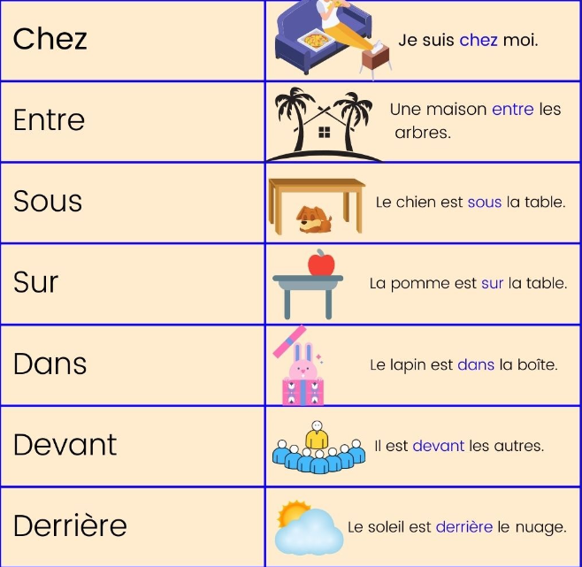

# Class 7

## Months -> Mois
Quel est le mois de ton anniversaire?
>C'est Septembre
## Seasons of the year -> stations de l'année
* Le Printemps -> Spring
* L’été -> Summer
* L’automne -> Fall
* L’hiver -> Winter
## Qu'est-ce que je porte? -> What di I wear?
Je porte une/un/des...->
* Un collier -> *Collar*
* Un bracelet -> *Brasalete*
* Une bague -> *Anillo*
* Des boucles d'oreilles -> *Aretes*
* Des lunettes (de soleil) -> *Lentes (de solo)*
* Un bonnete -> *Sombrero*
### Que puis-je acheter dans le Centre Commercial
Au *Centre Commercial* je peux acheter des vêtements.
>In a commertial center I can buy clothes.

Je peux vous aiden/Je peux t'aiden? -> *Can I help you?*  
__Answer:__  
* Je *<*veux|voudrais[More Formal]*>* une/un/des <*vêtement*>.
>I want a <*Clothe*>  
>Veux -> Want

La taille: Quelle est votre taille?
>Que 
## Qu'est-ce que vous faites avant d'aller à l'ecole?
## Le verbes pronominaux //*unit 3 lesson 3 page 7*
## Les accents, les signes //unit 4 lesson 2 
## Verbs
Faire -> *To do*

| Pronom     | Faire   |
| :--------- | :------ |
| Je         | Fais    |
| Tu         | Fais    |
| Il/Elle/On | Fait    |
| Nous       | Faisons |
| Vous       | Faites  |
| Ils/Elles  | Font    |

