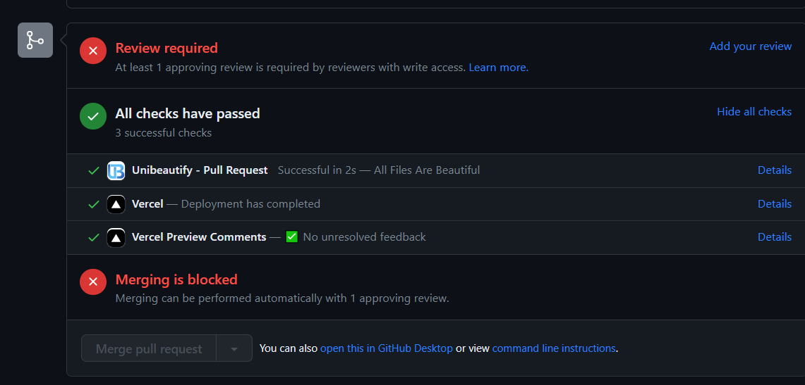

<style>
@import url('https://fonts.googleapis.com/css2?family=Montserrat:wght@300;400&display=swap');

div {
    font-family: 'Montserrat', sans-serif;
    font-size: 16px;
    text-align: justify;
}
</style>
<div>

# Implementación de un CI Flow
## Equipo 52
* Jorge Daniel Cruz Case        | A01634536  
* Vicente Javier Viera Guízar   | A01639784  
* Jairo Barrera Hernández       | A01276795  
* Siddhartha López Valenzuela   | A0022769  
* Jorge Plasencia Ahm Jorgensen | A01637493
_____________________________________________________
## Herramientas para CI Testing
Para nuestro proyecto decidimos utilizar __GitHub Actions__ y __Cypress__ debido a su baja curva de aprendizaje y fácil integración con la estructura de nuestro proyecto. Tabién recurrimos a la extención de vercel para GitHub Actions para testear el deployment.
## Proceso de testeo
El ciclo de integración continua empieza en cuanto se hace un pull request al repositorio.

En ese momento se ejecutan 4 scripts:
* Vercel haciendo deploy al servidor.
* Unibeautify revisando la integridad y convenciones del código.
* Vervel revisando previews pendientes
* Un script en ylm que ejecuta los tests en Cypress mediante npm.

Si alguno de estos scripts falla y reporta un error el pull request no será valido para ser mergeado. Además, el código debe de ser revisado por algún otro compañero colaborador del repositorio para poder realizarse el merge.
## Scripts


```yml
# This workflow will do a clean installation of node dependencies, cache/restore them, build the source code and run tests across different versions of node
# For more information see: https://docs.github.com/en/actions/automating-builds-and-tests/building-and-testing-nodejs

name: Node.js CI

on:
  push:
    branches:
        - "**"
        - "!main"
  pull_request:
    branches:
        - "**"
        - "!main"

jobs:
  build:

    runs-on: ubuntu-latest

    strategy:
      matrix:
        node-version: [14.x, 16.x, 18.x]
        # See supported Node.js release schedule at https://nodejs.org/en/about/releases/

    steps:
    - uses: actions/checkout@v3
    - name: Use Node.js ${{ matrix.node-version }}
      uses: actions/setup-node@v3
      with:
        node-version: ${{ matrix.node-version }}
        cache: 'npm'
    - run: npm ci
    - run: npm run build --if-present
    - run: npm test

```
</div>