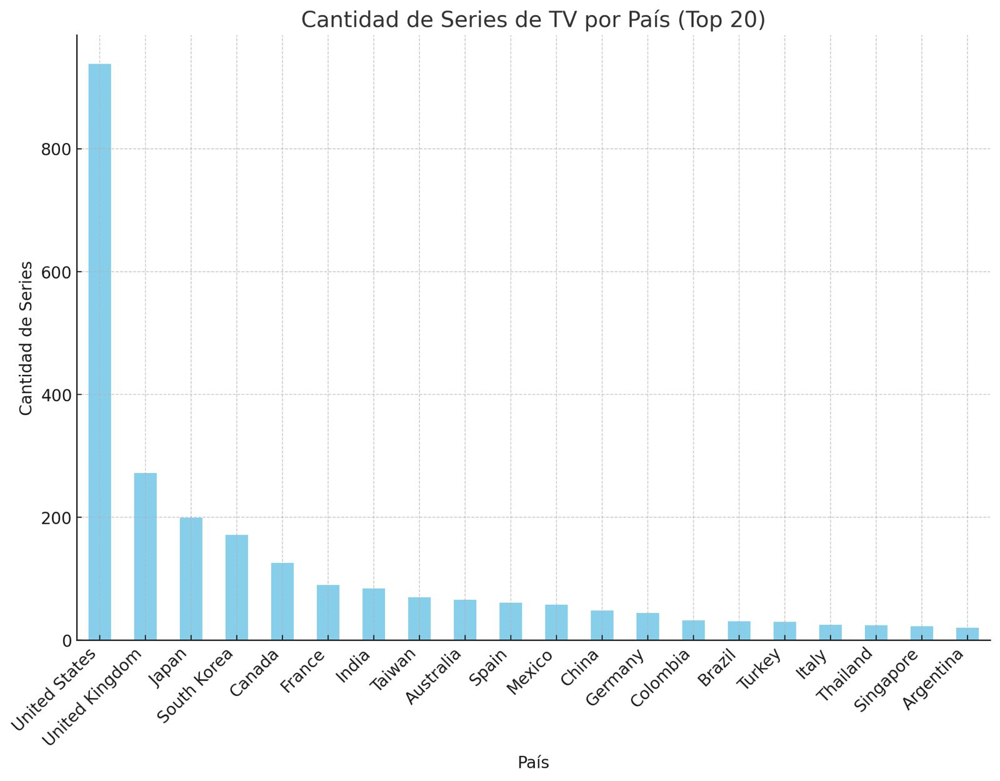

# Procesos de la vida real como distribuciones de probabilidad
## Histograma del número de series de Netflix por cada país

## Gráficas QQ
### Distribución Normal

### Distribución Exponencial

### Distribución Gamma

#### Análisis
Después de haber comparado los cuantiles teóricos con los cuantiles empíricos, puedo llegar a la conclusión de que una distribución *normal* podría convenir más para el set de datos que utilicé.
## Parámetros para la distribución normal
- Media: μ = 40.015
- Desviación estándar: σ = 121.586
## Uso del modelo
Se podría utilizar para crear una estrategia de negocios en la producción de una serie en Netflix. El análisis del histograma puede ayudar a saber qué país puede ser mejor para producir una serie para Netflix.
## Similitudes entre procesos
Precisamente las gráficas QQ que se realizaron en esta actividad proporcionan un acercamiento gráfico para analizar las similitudes entre procesos.

###### Ayudado con GPT <3