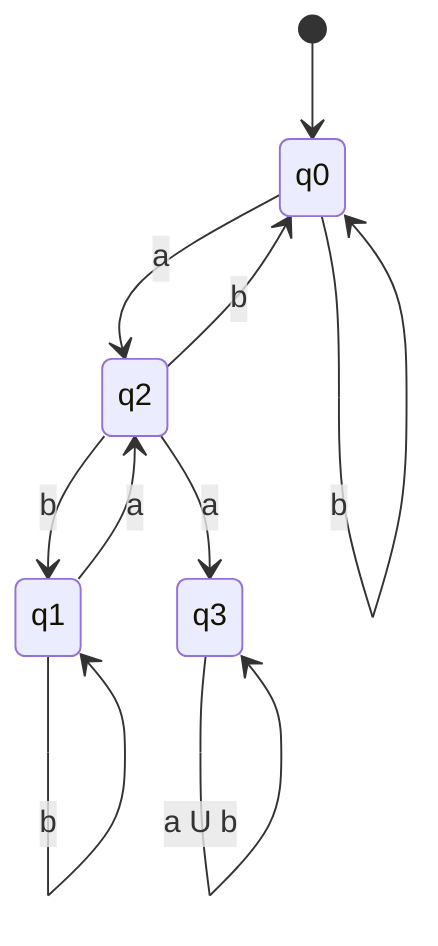

# Examen
## Vicente Javier Viera Guízar
## Pregunta 1
### What is the start state?
*q1*
### What is the set of accepted states?
*F = {q1, q4} ⊂ Q*
### What sequence of states does the machine go through on imput *aabb*?
*{q1, q1, q2, q4}*
### Does the machine accept the string *aabb*?
Yes, it does acept the string *aabb*.
### Does the machine accept the string ε?
No it does not.
## Pregunta 2
### Give the formal descritption of the previous machine.
- *Q = {q1, q2, q3, q4}*
- *Σ = {a, b}*
- *δ = Q ⨯ Σ =*
    |     | a   | b   |
    | --- | --- | --- |
    | q1  | q1  | q2  |
    | q2  | q3  | q4  |
    | q3  | q2  | q1  |
    | q4  | q3  | q4  |
- *q0 = {q1}*
- *F = {q1, q4}*
## Pregunta 3
### Draw the state diagram of a DFA for the language: *{w | w has even numbers of a's and each a is followed by at least one b}*
- *q0 = {q0}*
- *F = {q0}*

## Pregunta 4
### The following language is the complement of a simpler language. In each part, construct a DFA for the simpler language. *{w | w does not contain the substring ab}*
